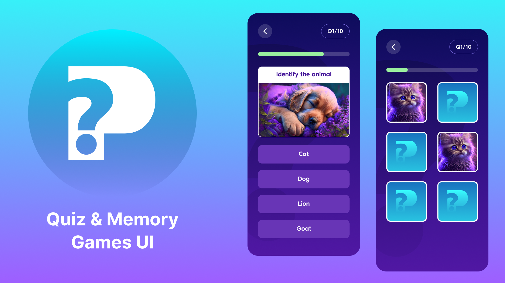

# 🧠 Quizzy Minds - A Fun & Interactive Quiz App

🎯 Challenge your brain, beat the clock, and rise to the top — the ultimate quiz battle begins now!

## 📸 Screenshot



---

## 🚀 Features

- 🔢 Multiple choice questions with 4 options
- 🎯 Score tracking and instant feedback
- 🗂️ Category-based questions (e.g., Science, Movies, Geography)
- 🕹️ Interactive UI with animations
- 💾 Progress saving (via localStorage or database)
- ✅ Responsive design for mobile & desktop

---

## 🖥️ Demo

🚧 Live demo coming soon...

Or run locally by following the steps below ⬇️

---

## 📂 Tech Stack

- **Frontend**: HTML, CSS, JavaScript
- **Styling**: Custom CSS
- **State Management**: LocalStorage

---

## 🔧 Installation & Setup

```bash

# Clone the repository

git clone https://github.com/Sajid-developer/Quiz-game-application.git
cd Quiz-game-application

```

## Open in your browser
open index.html

---

## ✨ Contribution
Contributions, issues, and feature requests are welcome!
Feel free to **fork** the repo and open a **pull request**.

---

## 📃 License
This project is licensed under the MIT License.

---

## 🙋‍♂️ Author
Sajid Alam

📧 [Email](sajid.developerr@gmail.com)
🔗 [LinkedIn](https://www.linkedin.com/in/sajid-developer/)

---

## 🌟 Show Your Support
If you like this project, please give a star⭐ to the repo to help others discover it!
